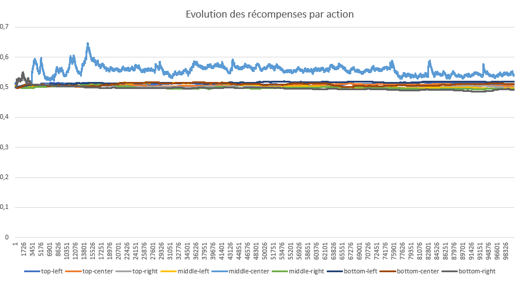

# Apprentissage par renforcement


## Lancer le projet
```
g++ main Morpion.cpp
main
```

## Le projet en C++
Le projet simule un grand nombre de partie, et utilise une table de positions pour associer à chaque état de la partie une liste de flottants correspondant à la récompense pour chaque action. Une récompense de -1 indique une action impossible (mettre un pion sur une case occupée).
Les données apprises sont exportées dans un fichier CSV à la fin de l'entrainement.

## Mécanisme apprentissage

Toutes les récompenses sont initialisées à la même valeur.
A la fin de chaque partie les poids de chaque action jouée pendant cette partie sont actualisés, selon la régle :
```
NOUVEAU_POIDS = RECOMPENSE * TAUX_APPRENTISSAGE + ANCIEN_POIDS * (1 - TAUX_APPRENTISSAGE)
```
Ce qui correpond à une moyenne mobile pondérée par un paramètre.
Les hyper-paramètres sont ici :
- LEARNING_RATE : le tauix d'apprentissage, permettant de pondérer la moyenne mobile
- WIN_REWARD : la récompense en cas de victoire
- DEFEAT_REWARD : la récompense en cas de défaite
- DRAW_REWARD : la récompense en cas d'égalité
- INVALID_MOOVE_REWARD : la récompense d'une action impossible
- INIT_VALUE : la valeur d'initialisation des poids

## Graphiques

On peut ainsi tracer l'évolution de la récompense pour chaque action au premier coup de la partie (grille complètement vide).

Pour stabiliser ces courbes, on utilisera un taux d'apprentissage plus faible (0.007 vs 0.03)


On a ici décidé d'initialiser les récompenses à 0.75. Elle décroivent donc avec une certaine instabilité, avant de se stabiliser et de converger.

